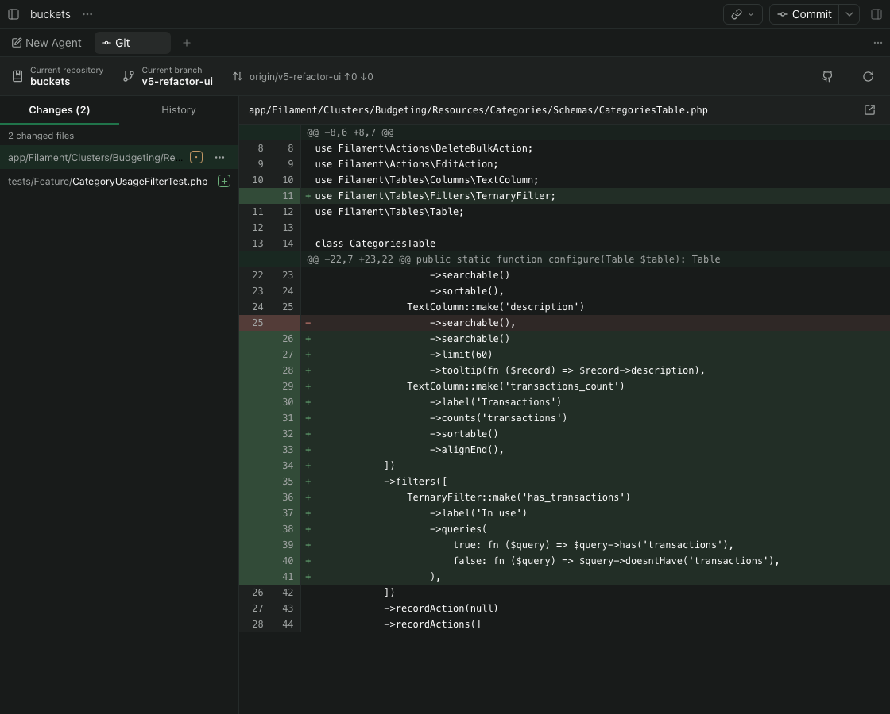
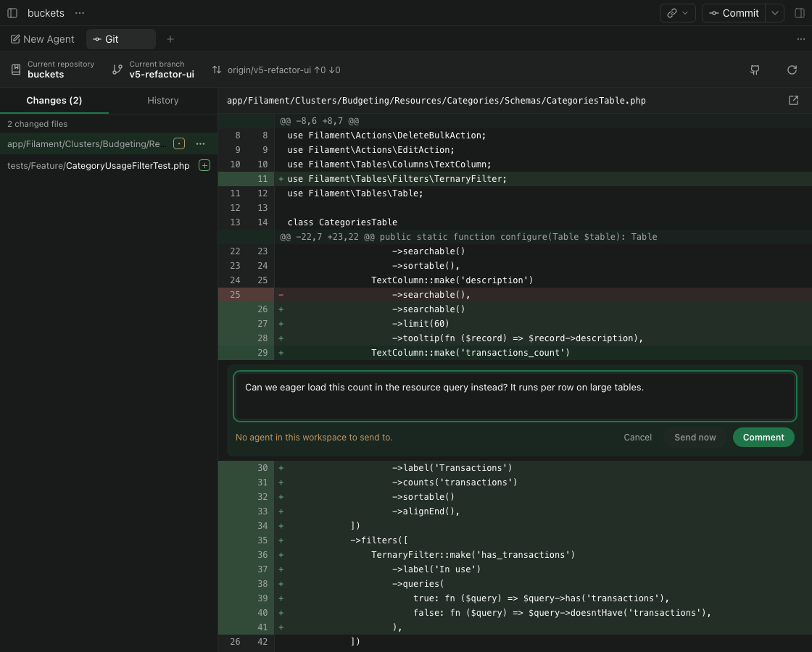
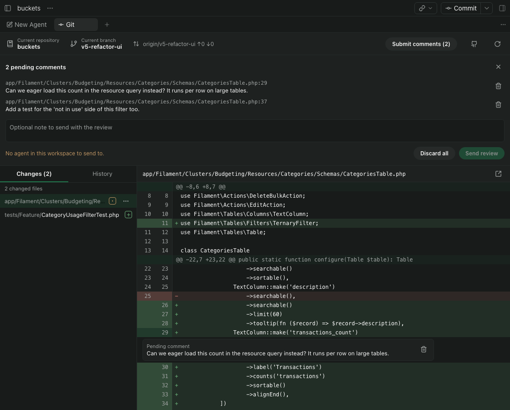
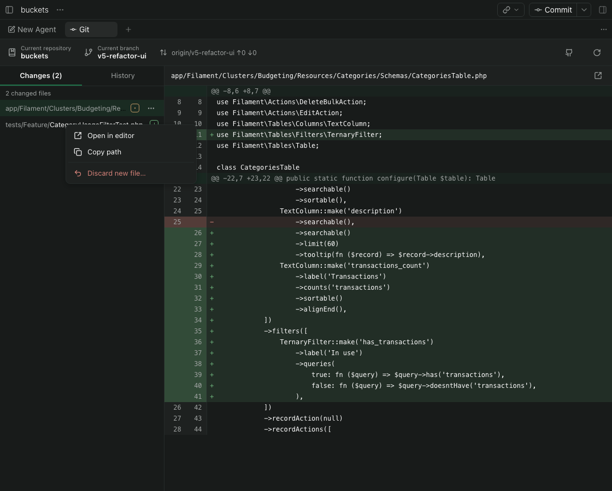
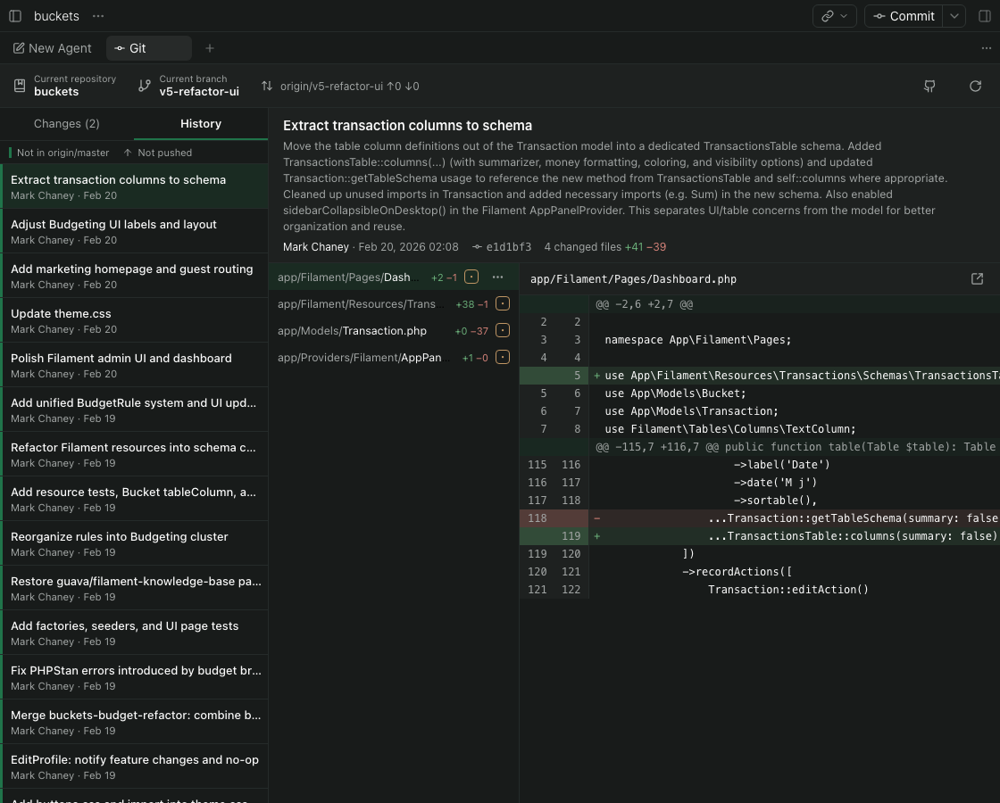

# GitHub Desktop for Paseo

A GitHub Desktop-style **Git** panel for Paseo workspaces: browse uncommitted changes and commit history, read diffs, and leave line comments for your agent, without leaving Paseo.

Not affiliated with GitHub. The name describes the layout it borrows.



| Comment on any line | Review queued comments |
| --- | --- |
|  |  |
| **File actions** | **History** |
|  |  |

## Features

- **Changes:** every uncommitted file (modified, added, deleted, renamed, untracked) with its diff against `HEAD`, refreshed every couple of seconds.
- **History:** the branch's commits, paged, marked when they are unpushed or not yet on the base branch. Select a commit to see its files and per-file diffs.
- **Line comments for agents:** click any diff line to comment on it.
  - **Comment** queues it; **Submit comments (N)** at the top right sends the batch with an optional note.
  - **Send now** delivers just that comment straight away.
  - Agents receive Paseo's own review attachment (file, line, side, and surrounding diff), the same as built-in diff comments.
  - Comments sent while an agent is working are added to its current turn instead of interrupting it.
- **File actions:** right-click (desktop), long-press (mobile) or **⋯** on a file:
  - **Open in editor**, jumping to the line you are commenting on
  - **Copy path**
  - **Discard changes**, with a confirmation. Discarded content goes to the Trash / Recycle Bin, so mistakes are recoverable.
- **Open in GitHub Desktop** from the toolbar or ⌘K, when GitHub Desktop is installed.
- **Built for large repositories:** virtualized lists and diffs, diffs over 1 MB or 5,000 lines load only on request, and the Changes list caps at 2,000 files while still showing the real total.

## Install

Requires Paseo **0.11** or later, with plugins enabled (**Settings → Plugins → Enable plugins**) on the host where you install it.

Install it on the daemon host from npm or GitHub:

```bash
paseo plugin install npm:paseo-github-desktop
# or
paseo plugin install github:MACscr/paseo-github-desktop
```

You can also paste either source into **Settings → Plugins → Plugin source**.

From a local checkout, for development:

```bash
git clone https://github.com/MACscr/paseo-github-desktop.git
cd paseo-github-desktop
npm install
paseo plugin install "$(pwd)"
```

Then open a workspace on that host and either open the **Git** tab or press ⌘K and choose **Open Git view**.

Plugins are installed per daemon, so the panel appears only for workspaces on hosts that have it installed.

## Settings

**Settings → Plugins → GitHub Desktop → Editor** chooses what **Open in editor** uses:

| Option | Behaviour |
| --- | --- |
| Automatic | The first installed of VS Code, Cursor, Zed and Sublime Text |
| VS Code, Cursor, Zed, Sublime Text | That editor; marked "(not found)" if its command is missing |
| Custom command | Any program, with your own arguments |

For **Custom command**:

- **Command:** a name on the daemon's `PATH`, an absolute path, or a macOS `.app` bundle. A `.app` opens the file but cannot jump to a line, so point at the app's command-line tool if you want line numbers.
- **Arguments:** use `{file}` for the absolute path and `{line}` for the line number (1 when there is none). Quote arguments that contain spaces. If `{file}` is missing, the file is added at the end.

PhpStorm example:

```text
Command:   /Applications/PhpStorm.app/Contents/MacOS/phpstorm
Arguments: --line {line} "{file}"
```

Settings are stored on the host, so every client connected to it shares them.

## Platforms

| | macOS | Linux | Windows |
| --- | --- | --- | --- |
| Changes, History, comments | Yes | Yes | Yes |
| Discard to Trash | `/usr/bin/trash` | `gio`, `trash-put` or KDE `kioclient` | Recycle Bin via PowerShell |
| Open in editor | Yes | Yes | Yes (`.exe` / `.cmd` commands) |
| Open in GitHub Desktop | Yes | Community build (`github-desktop`) | Yes (`github` command) |

The panel works in the desktop app, the web UI, and on mobile. Windows support is implemented but has not been tested on a Windows machine yet.

## Limitations

- Editors and GitHub Desktop open on the daemon's machine, not on the device you are viewing Paseo from.
- Paseo has no API for plugins to add to its chat box, so comments go to the agent as a message instead of a draft chip.
- Plugins cannot open files in Paseo's own Files panel or add entries to its Open in menu.
- Queued comments last until the app is closed; they are not saved across restarts.
- With no Trash available (for example a bare Linux server), discarding deletes permanently. The confirmation says so first.
- Windows support has not been tested on a Windows machine yet.

## Development

```bash
npm install
npm run typecheck
npm test
paseo plugin reload github-desktop   # after each change
paseo plugin logs github-desktop     # daemon-side output
```

Code is split by runtime, as Paseo requires:

| Path | Runs in |
| --- | --- |
| `index.client.tsx`, `client/` | The Paseo app (React Native, so it also works on mobile) |
| `index.server.ts`, `server/` | A daemon subprocess (git, editors, Trash) |
| `shared/` | Both: RPC contracts and settings schema |

Git runs with `GIT_OPTIONAL_LOCKS=0`, so the panel's background polling never blocks an agent's own git commands.

## License

MIT. See [LICENSE](LICENSE).
